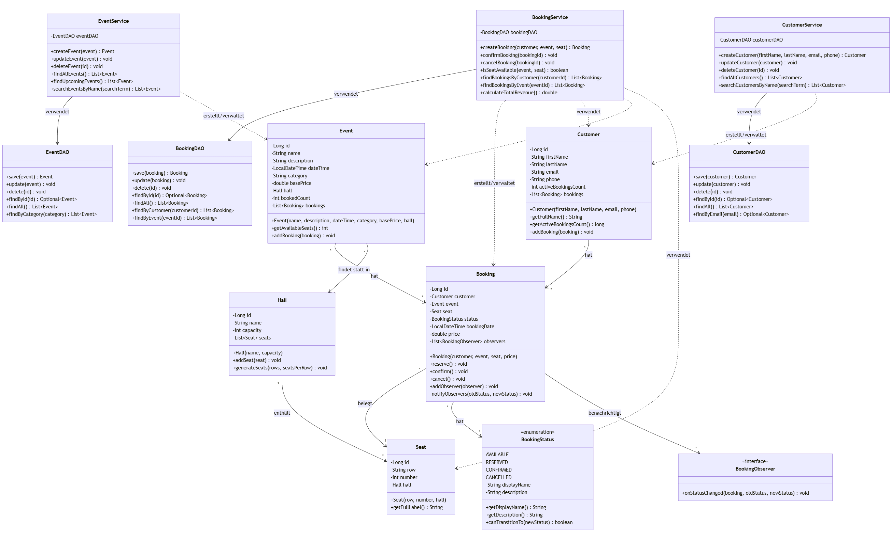

# Klassendiagramm - Event Booking System

Dieses Diagramm zeigt die Hauptklassen des Event Booking Systems und ihre Beziehungen.

## Hauptklassen

### Model-Klassen

#### Customer (Kunde)
- Repräsentiert einen Kunden im System
- Enthält persönliche Informationen (Name, E-Mail, Telefon)
- Verwaltet eine Liste von Buchungen
- Berechnet die Anzahl aktiver Buchungen

#### Event (Veranstaltung)
- Repräsentiert eine Veranstaltung
- Enthält Informationen wie Name, Beschreibung, Datum, Kategorie und Basispreis
- Ist einem Saal zugeordnet
- Berechnet verfügbare Sitzplätze dynamisch

#### Booking (Buchung)
- Repräsentiert eine Buchung
- Verbindet Kunde, Event und Sitzplatz
- Verwaltet den Buchungsstatus (State Pattern)
- Implementiert Observer Pattern für Statusänderungen
- Enthält Geschäftslogik für Zustandsübergänge (reserve, confirm, cancel)

#### BookingStatus (Buchungsstatus)
- Enumeration für Buchungszustände
- Definiert gültige Zustandsübergänge
- Vier Zustände: AVAILABLE, RESERVED, CONFIRMED, CANCELLED

#### Hall (Saal)
- Repräsentiert einen Veranstaltungssaal
- Enthält eine Liste von Sitzplätzen
- Kann Sitzplätze automatisch generieren

#### Seat (Sitzplatz)
- Repräsentiert einen einzelnen Sitzplatz
- Gehört zu einem Saal
- Hat Reihe und Nummer

### Service-Klassen

#### BookingService
- Geschäftslogik für Buchungen
- Erstellt, bestätigt und storniert Buchungen
- Prüft Verfügbarkeit von Sitzplätzen
- Berechnet Preise und Umsätze
- Verwendet Stream API und Lambda-Ausdrücke

#### CustomerService
- Geschäftslogik für Kunden
- CRUD-Operationen für Kunden
- Validierung von Kundendaten
- Such- und Filterfunktionen

#### EventService
- Geschäftslogik für Events
- CRUD-Operationen für Events
- Filtert zukünftige Events
- Gruppiert Events nach Kategorie

### DAO-Klassen (Data Access Objects)

#### BookingDAO, CustomerDAO, EventDAO
- Datenbankzugriff für jeweilige Entitäten
- CRUD-Operationen
- Spezielle Abfragen (z.B. findByCustomer, findByEvent)

## Design Patterns

### Observer Pattern
- `Booking` benachrichtigt `BookingObserver` bei Statusänderungen
- Ermöglicht lose Kopplung zwischen Buchung und abhängigen Komponenten

### State Pattern
- `BookingStatus` definiert Zustände und gültige Übergänge
- `Booking` delegiert Zustandslogik an `BookingStatus`

### DAO Pattern
- Trennung von Geschäftslogik (Service) und Datenzugriff (DAO)
- Ermöglicht einfachen Austausch der Persistenzschicht

### Service Layer Pattern
- Service-Klassen kapseln Geschäftslogik
- Controller verwenden Services, nicht direkt DAOs
