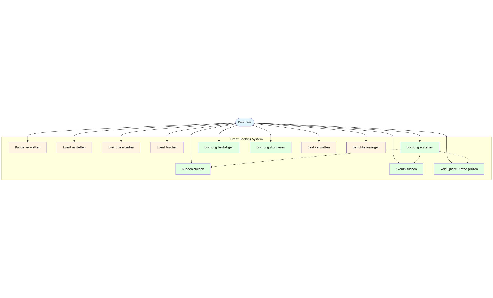

# Use-Case-Diagramm - Event Booking System

Dieses Diagramm zeigt die Hauptanwendungsfälle des Event Booking Systems und die Interaktionen zwischen Benutzern und dem System.

## Akteur

### Benutzer
Der Benutzer hat Zugriff auf alle Funktionen des Systems:
- **Kundenverwaltung**: Kunden erstellen, bearbeiten und löschen
- **Event-Verwaltung**: Events erstellen, bearbeiten und löschen
- **Saalverwaltung**: Säle erstellen und Sitzplätze generieren
- **Buchungsverwaltung**: Buchungen erstellen, bestätigen und stornieren
- **Suche**: Kunden und Events suchen
- **Berichte**: Statistiken und Umsatzberichte anzeigen
- **Verfügbarkeit**: Verfügbare Plätze prüfen

## Hauptanwendungsfälle

### Kundenverwaltung (UC1)
- **Akteur**: Benutzer
- **Beschreibung**: Erstellen, Bearbeiten und Löschen von Kundendaten
- **Implementierung**: `CustomerService`, `CustomerController`, `CustomerManagementView`

### Event erstellen (UC2)
- **Akteur**: Benutzer
- **Beschreibung**: Neue Events mit Datum, Kategorie, Preis und Saal erstellen
- **Implementierung**: `EventService.createEvent()`, `EventDialog`

### Event bearbeiten (UC3)
- **Akteur**: Benutzer
- **Beschreibung**: Bestehende Events aktualisieren
- **Implementierung**: `EventService.updateEvent()`, `EventDialog`

### Event löschen (UC4)
- **Akteur**: Benutzer
- **Beschreibung**: Events aus dem System entfernen
- **Implementierung**: `EventService.deleteEvent()`

### Buchung erstellen (UC5)
- **Akteur**: Benutzer
- **Beschreibung**: Neue Buchung für einen Kunden, Event und Sitzplatz erstellen
- **Vorbedingungen**: Kunde muss existieren, Event muss verfügbar sein, Platz muss frei sein
- **Implementierung**: `BookingService.createBooking()`, `BookingDialog`
- **Includes**: UC10 (Kunden suchen), UC11 (Events suchen), UC12 (Verfügbare Plätze prüfen)

### Buchung bestätigen (UC6)
- **Akteur**: Benutzer
- **Beschreibung**: Reservierte Buchung bestätigen (Zahlung erfolgt)
- **Implementierung**: `BookingService.confirmBooking()`

### Buchung stornieren (UC7)
- **Akteur**: Benutzer
- **Beschreibung**: Bestehende Buchung stornieren
- **Implementierung**: `BookingService.cancelBooking()`

### Saal verwalten (UC8)
- **Akteur**: Benutzer
- **Beschreibung**: Säle erstellen und Sitzplätze generieren
- **Implementierung**: `HallService`, `Hall.generateSeats()`

### Berichte anzeigen (UC9)
- **Akteur**: Benutzer
- **Beschreibung**: Statistiken und Umsatzberichte anzeigen
- **Implementierung**: `ReportController`, `ReportView`

### Kunden suchen (UC10)
- **Akteur**: Benutzer
- **Beschreibung**: Kunden nach Namen oder E-Mail suchen
- **Implementierung**: `CustomerService.searchCustomersByName()`

### Events suchen (UC11)
- **Akteur**: Benutzer
- **Beschreibung**: Events nach Namen oder Kategorie suchen
- **Implementierung**: `EventService.searchEventsByName()`, `EventService.findEventsByCategory()`

### Verfügbare Plätze prüfen (UC12)
- **Akteur**: Benutzer
- **Beschreibung**: Verfügbarkeit von Sitzplätzen für ein Event prüfen
- **Implementierung**: `BookingService.isSeatAvailable()`, `Event.getAvailableSeats()`
