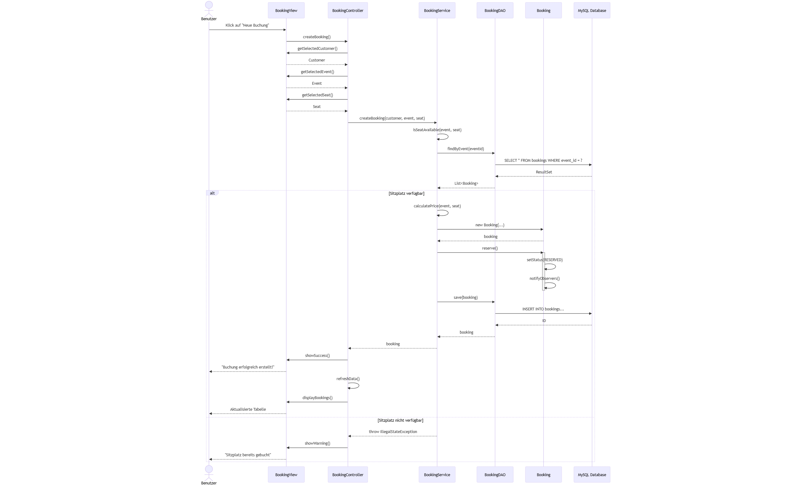

# Zustandsdiagramm - Buchungsstatus

Dieses Diagramm zeigt die möglichen Zustände einer Buchung (`Booking`) und die gültigen Übergänge zwischen ihnen.



## Beschreibung der Zustände

### AVAILABLE (Verfügbar)
- **Beschreibung**: Der Platz ist für eine Buchung verfügbar
- **Mögliche Übergänge**: 
  - → `RESERVED` über die Methode `reserve()`

### RESERVED (Reserviert)
- **Beschreibung**: Der Platz wurde reserviert, aber noch nicht bestätigt
- **Mögliche Übergänge**: 
  - → `CONFIRMED` über die Methode `confirm()`
  - → `CANCELLED` über die Methode `cancel()`

### CONFIRMED (Bestätigt)
- **Beschreibung**: Die Buchung wurde bestätigt und die Zahlung wurde durchgeführt
- **Mögliche Übergänge**: 
  - → `CANCELLED` über die Methode `cancel()`

### CANCELLED (Storniert)
- **Beschreibung**: Die Buchung wurde storniert (Endzustand)
- **Mögliche Übergänge**: Keine (Endzustand)

## Übergangsregeln

Die Übergänge werden in der Methode `canTransitionTo()` der Klasse `BookingStatus` implementiert:

```java
public boolean canTransitionTo(BookingStatus newStatus) {
    return switch (this) {
        case AVAILABLE -> newStatus == RESERVED;
        case RESERVED -> newStatus == CONFIRMED || newStatus == CANCELLED;
        case CONFIRMED -> newStatus == CANCELLED;
        case CANCELLED -> false; // Endzustand
    };
}
```

## Observer-Pattern

Wenn eine Buchung den Zustand wechselt, werden alle registrierten Observer über die Methode `notifyObservers(oldStatus, newStatus)` benachrichtigt.
